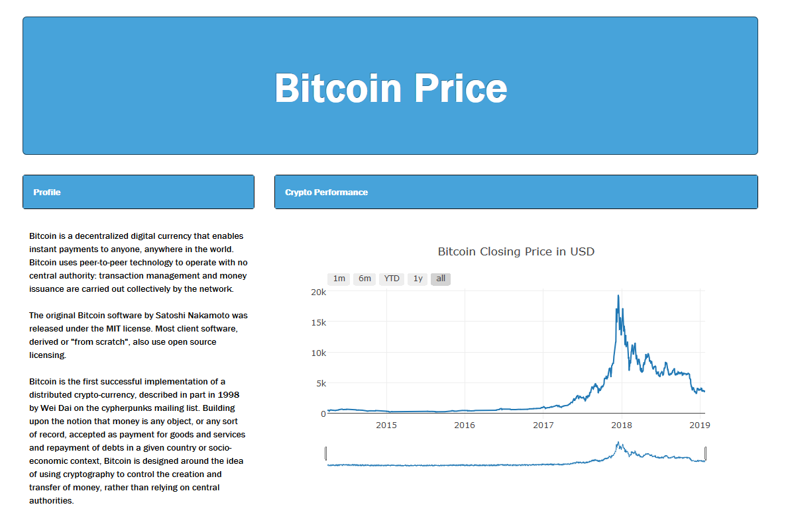

## Team 3 Project VIP 

### Topic: Crypto and Stock

Relationship/Rationale: Track price change for Cryptocurrencies and Stock Index for a given date range and visualize the ATM locations of Cryptocurrencies.

---

Design: 
1) Main index.html page 
    - Allow user to select the price index of Cryptocurrency, Stock, and Map.
1) Leaflet Map 
    - Using markers to pin point all of the Crypto ATM’s in the USA.
    - Using a Heatmap to highlight the more densely populated Crypto ATM locations.
    - Each leaflet marker will contain tool tip to give coordinates or address of the Cryptocurrency ATM 
    - Each leaflet tool tip will link to google streets view of that location.
1) Plotly 
    - Brief description of each Cryptocurrency and Stock Index. 
    - Plot the price changes for Cryptocurrency and Stock with interactive slider and buttons.
1) Scrape latest Cryptocurrency news.
    - Using a mongoDB to store the latest crypto news.
    - Create links to the latest Cryptocurrency news on the main index.html page after scraping.

---

Data Sources: JSON file links

API for crypto and stocks: https://www.alphavantage.co/documentation/

crypto ATMs: https://www.coinatmfinder.com/CoimATMs-API.php

---

### Main Page

### Scraping Crypto News

### Plotly Plot Page

### Leaflet Map Page

---

## Requirements

1) Download and Install Mongo DB
https://www.mongodb.com/download-center/compass?filter=enterprise
1) Git Clone Repository
1) $ pip install (modules)
1) Run app.py file
1) View in browser
