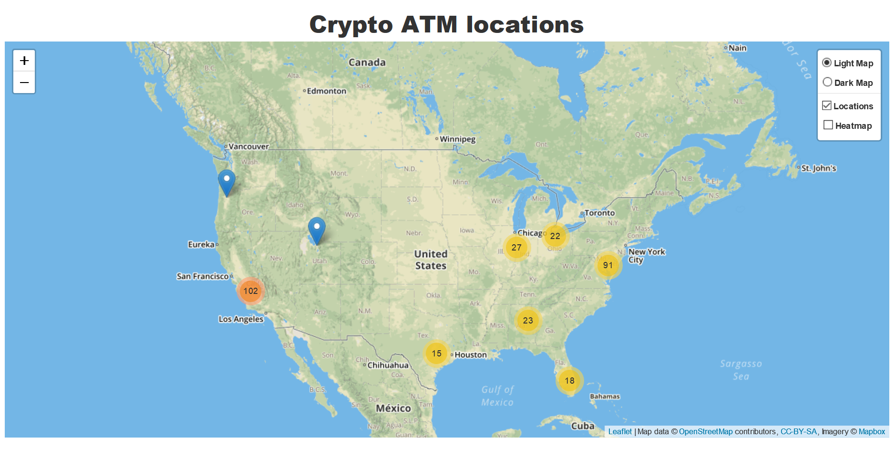

## Team 3 Project VIP 

### Topic: Crypto and Stock

Relationship/Rationale: Track price change for Cryptocurrencies and Stock Index for a given date range and visualize the ATM locations of Cryptocurrencies.

Crypto: 
1) Leaflet Map that will list using markers all of the Crypto ATM’s in the USA.
 * Each leaflet marker will contain tool tip to give the location of the Cryptocurrency ATM and link to google street maps view of that location.
1) Plotly plot outlining price change of 5 cryptocurrencies.
1) 
...

Design Ideas for Stock/Financial District: 
A Flask page that contain a scrap button that will retrieve the latest stock info for certain stocks that will automatically generate a plot. For stocks, we will consider Dow Jones Index and S&P 500 Index since they have a very good representation of the stock market.
Example 12-15  https://moderndata.plot.ly/15-python-and-r-charts-with-interactive-controls-buttons-dropdowns-and-sliders/

Create a graph comparing trading volume of the 5 cryptocurrency that we are looking into versus major stock exchanges in US (Nasdaq and Dow Jones) - we can use API/SQL for the data redring and plotly for graph….

---

Data Sources: JSON file links

API for crypto and stocks: https://www.alphavantage.co/documentation/

crypto ATMs: https://www.coinatmfinder.com/CoimATMs-API.php

---

---

## Requirements
1) Download and Install Mongo DB
https://www.mongodb.com/download-center/compass?filter=enterprise
1) Git Clone Repository
1) $ pip install (modules)
1) Run app.py file
1) View in browser
