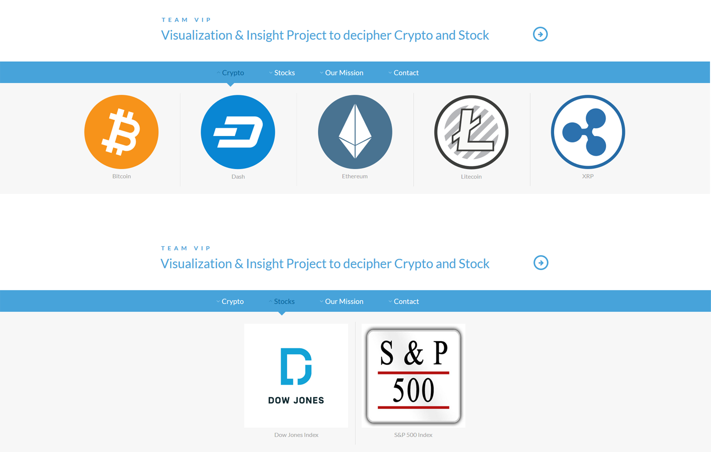

## Team 3 Project 2 Proposal

### Team name: Team VIP (Visualization and Insightful Project) 

#### Topic: Crypto and Stock/Financial District

Relationship/Rationale: Track exchange rates for Crypto currencies for a given date range and visualize the ATM locations of these Crypto currencies.

Design Ideas for Crypto: 
Leaflet Map that will list using markers all of the Crypto ATM’s in the USA and whatever other countries we decide on.
Map will contain filter to allow users to select any specific Crypto.
i) Focus on analysis of top ten Cryptocurrencies; Bitcoin, Ethereum, Litecoin, Ripple, Stellar, EOS, Tron, Binance Coin, Cardano, Bitcoin Cash.
Map will contain a search field to allow user to find the number of Crypto ATM’s in a given geographical location.
Advanced: Allowed user to find the closest Crypto ATM to their geographical location.
Advanced: Use custom marker icons
https://leafletjs.com/examples/custom-icons/
Each marker will contain tool tip to give info about Crypto ATM.
Suggestions: Probably should limit the type of crypto currency to a few of the most popular ones, due to time constraint.
D3 Bubble Chart that will list by country or state the number of Crypto ATM’s in the USA or World.
Size of bubble chart will be based off of the number of Crypto ATM’s available.
https://beta.observablehq.com/@mbostock/d3-bubble-chart
Plotly Dashboard outlining individual tickers https://plot.ly/products/dash/ (possible idea - jarvis) - Integrate Plotly’s API?
...

Design Ideas for Stock/Financial District: 
A Flask page that contain a scrap button that will retrieve the latest stock info for certain stocks that will automatically generate a plot. For stocks, we will consider Dow Jones Index and S&P 500 Index since they have a very good representation of the stock market.
Example 12-15  https://moderndata.plot.ly/15-python-and-r-charts-with-interactive-controls-buttons-dropdowns-and-sliders/

Create a graph comparing trading volume of the 5 cryptocurrency that we are looking into versus major stock exchanges in US (Nasdaq and Dow Jones) - we can use API/SQL for the data redring and plotly for graph….

Data Sources: JSON file links

API for crypto and stocks: https://www.alphavantage.co/documentation/

crypto ATMs: https://www.coinatmfinder.com/CoimATMs-API.php

